# Mini Trade - 加密货币交易应用

一个现代化的 React + TypeScript 加密货币交易应用，提供实时行情、交易下单、订单管理等功能。

[](https://vercel.com/new/clone?repository-url=https://github.com/YOUR_USERNAME/mini-trade)
[](https://app.netlify.com/start/deploy?repository=https://github.com/YOUR_USERNAME/mini-trade)

> ⚠️ **注意**: 部署前请将 README 中的 `YOUR_USERNAME` 替换为你的 GitHub 用户名

## ✨ 功能特性

- 🔄 **实时行情数据** - WebSocket 连接，实时更新买卖盘数据
- 📊 **K线图表** - 集成 TradingView 图表库，支持多周期切换
- 📖 **订单簿** - 实时显示买卖盘深度，支持聚合显示
- 💰 **交易下单** - 支持限价单和市价单，实时余额显示
- 📝 **历史订单** - 查看历史成交记录，支持刷新和筛选
- 🌓 **深色/浅色主题** - 支持系统主题切换
- 🌍 **国际化** - 支持中英文切换
- 📱 **响应式设计** - 完美适配桌面端和移动端

## 🚀 快速开始

### 环境要求

- Node.js >= 18.0.0
- pnpm >= 8.0.0 (推荐) 或 npm >= 9.0.0

### 安装依赖

```bash
pnpm install
```

或使用 npm：

```bash
npm install
```

### 启动开发服务器

```bash
pnpm dev
```

或使用 npm：

```bash
npm run dev
```

应用将在 `http://localhost:5173` 启动。

### 构建生产版本

```bash
pnpm build
```

### 预览生产构建

```bash
pnpm preview
```

## 📁 项目结构

```
mini-trade/
├── src/
│   ├── adaptor/          # 交易所适配器
│   │   └── biance/       # Binance API 适配器
│   ├── components/        # React 组件
│   │   ├── styles/       # 组件样式文件
│   │   ├── Balance.tsx   # 余额组件
│   │   ├── BookTicker.tsx # 行情数据组件
│   │   ├── ExchangeHeader.tsx # 交易所头部
│   │   ├── HistoricalOrders.tsx # 历史订单
│   │   ├── Kline.tsx     # K线图组件
│   │   ├── Main.tsx      # 主布局组件
│   │   ├── OrderBook.tsx # 订单簿组件
│   │   └── TradeForm.tsx # 交易表单
│   ├── hooks/            # 自定义 Hooks
│   │   ├── useBinanceWebSocket.ts # WebSocket Hook
│   │   └── useWorker.ts  # Web Worker Hook
│   ├── locales/          # 国际化文件
│   │   ├── i18n.ts       # i18n 配置
│   │   ├── zh-CN.json    # 中文翻译
│   │   └── en-US.json    # 英文翻译
│   ├── workers/          # Web Workers
│   │   └── calculationWorker.ts # 计算 Worker
│   ├── App.tsx           # 主应用组件
│   └── main.tsx          # 应用入口
├── public/               # 静态资源
├── .github/              # GitHub Actions 配置
├── package.json
├── vite.config.js        # Vite 配置
└── tsconfig.json         # TypeScript 配置
```

## 🏗️ 架构设计

```mermaid
graph TB
    A[用户界面] --> B[React 组件层]
    B --> C[自定义 Hooks]
    C --> D[数据适配层]
    D --> E[Binance API]
    D --> F[WebSocket 连接]
    
    B --> G[Web Workers]
    G --> H[计算密集型任务]
    
    C --> I[localStorage]
    I --> J[数据持久化]
    
    B --> K[Ant Design UI]
    B --> L[样式系统]
    
    subgraph "实时数据流"
        F --> M[Trade 数据]
        F --> N[Kline 数据]
        F --> O[BookTicker 数据]
    end
    
    subgraph "业务逻辑"
        H --> P[PnL 计算]
        H --> Q[投资计算]
    end
```



### 核心架构说明

1. **组件层（Components）**
   - 使用 React 函数组件和 Hooks
   - 组件按功能模块划分，样式统一管理

2. **数据适配层（Adapter）**
   - 抽象交易所接口，支持多交易所扩展
   - 当前实现 Binance 适配器

3. **WebSocket 实时通信**
   - 自动重连机制
   - 数据本地缓存（localStorage）

4. **Web Workers**
   - 计算密集型任务（PnL、投资计算）移至 Worker
   - 避免阻塞主线程，保证 UI 流畅

5. **状态管理**
   - 使用 React Hooks（useState, useEffect）
   - localStorage 持久化

## 🛠️ 技术栈

- **前端框架**: React 19 + TypeScript
- **构建工具**: Vite 7
- **UI 组件库**: Ant Design 5
- **样式方案**: CSS Variables + Flex/Grid 布局
- **图表库**: TradingView Charting Library
- **国际化**: react-i18next
- **HTTP 客户端**: Axios
- **WebSocket**: 原生 WebSocket API
- **代码质量**: ESLint + Prettier + Husky

## 📦 可用脚本

```bash
# 开发
pnpm dev              # 启动开发服务器

# 构建
pnpm build            # 构建生产版本

# 代码质量
pnpm lint             # 运行 ESLint 检查
pnpm lint:fix         # 自动修复 ESLint 错误
pnpm format           # 格式化代码

# 测试
pnpm test             # 运行单元测试
pnpm test:e2e         # 运行 E2E 测试
pnpm test:coverage    # 生成测试覆盖率报告

# 性能
pnpm lighthouse       # 运行 Lighthouse 性能测试
```

## 🔧 配置说明

### 环境变量

创建 `.env.local` 文件（可选）：

```env
VITE_BINANCE_API_BASE=https://testnet.binance.vision
VITE_BINANCE_WS_BASE=wss://stream.testnet.binance.vision
```

### API 配置

应用默认使用 Binance 测试网 API，可在 `src/adaptor/biance/config.ts` 中修改。

## 🧪 测试

### 单元测试

使用 Vitest 运行单元测试：

```bash
pnpm test
```

### E2E 测试

使用 Playwright 运行端到端测试：

```bash
pnpm test:e2e
```

## 📊 性能优化

- ✅ Web Workers 处理计算任务
- ✅ React.memo 优化组件渲染
- ✅ localStorage 缓存数据
- ✅ 虚拟滚动（订单簿）
- ✅ 响应式图片和懒加载
- ✅ CSS 变量实现主题切换

## 🌐 部署

### Vercel 部署

1. 点击 README 顶部的 "Deploy with Vercel" 按钮
2. 连接你的 GitHub 仓库
3. 自动部署完成

### Netlify 部署

1. 点击 README 顶部的 "Deploy with Netlify" 按钮
2. 连接你的 GitHub 仓库
3. 配置构建命令：`pnpm build`
4. 配置发布目录：`dist`

### 手动部署

```bash
# 构建项目
pnpm build

# 部署 dist 目录到你的静态网站托管服务
```

## 🤝 贡献指南

1. Fork 本项目
2. 创建功能分支 (`git checkout -b feature/AmazingFeature`)
3. 提交更改 (`git commit -m 'Add some AmazingFeature'`)
4. 推送到分支 (`git push origin feature/AmazingFeature`)
5. 开启 Pull Request

## 📝 开发规范

- 使用 TypeScript 严格模式
- 遵循 ESLint 和 Prettier 规则
- 提交前自动运行 lint 检查（Husky）
- 组件使用函数式组件 + Hooks
- 样式使用 CSS Modules 或统一样式文件

## 📄 许可证

本项目采用 MIT 许可证。

## 🙏 致谢

- [Binance API](https://binance-docs.github.io/apidocs/) - 提供交易 API
- [Ant Design](https://ant.design/) - UI 组件库
- [TradingView](https://www.tradingview.com/) - 图表库
- [Vite](https://vitejs.dev/) - 构建工具

